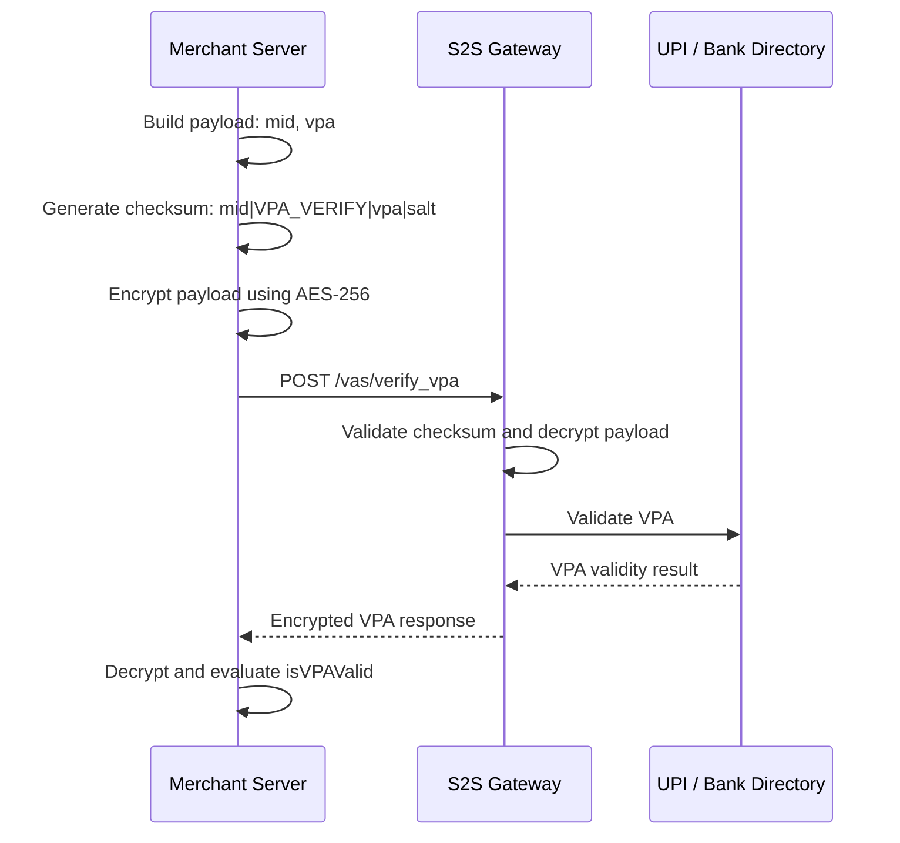
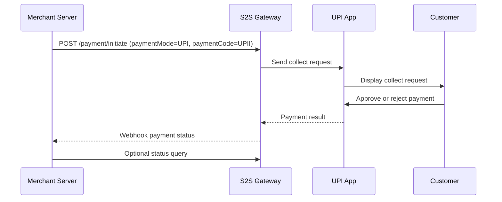
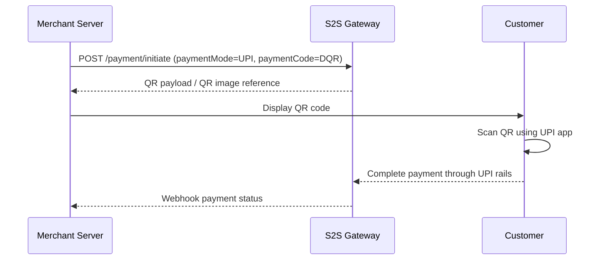
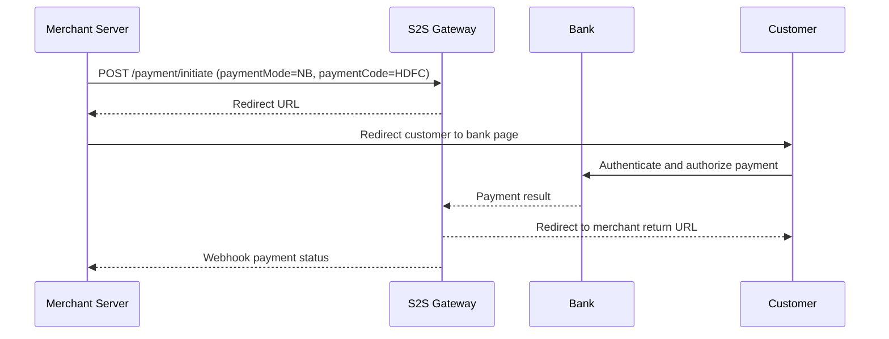
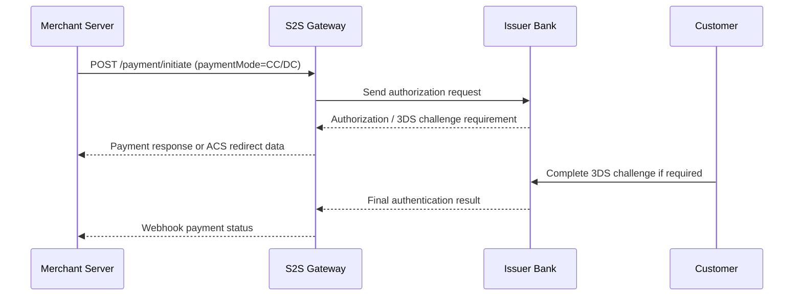
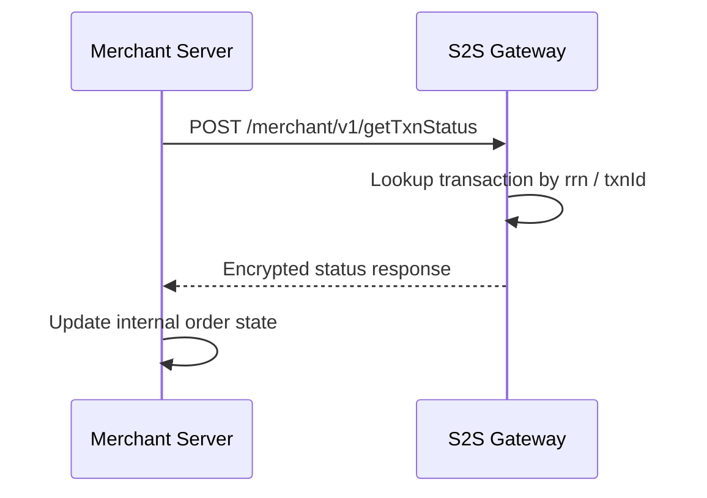
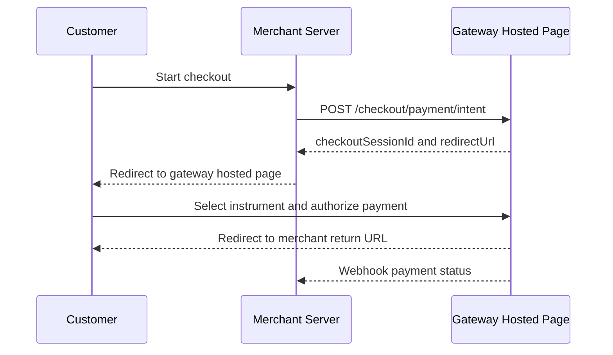
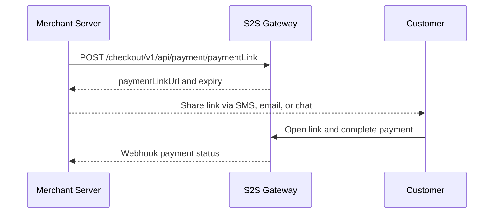

Use these payment flow diagrams to understand how your server, the S2S Payment Gateway, and downstream payment networks exchange requests and statuses.

## 1. VPA Verification Flow



Use this flow before UPI Collect payments to reduce payment failures caused by invalid UPI IDs.

<br />

## 2. UPI Collect Flow



The initial API response may be `PENDING`. Treat the webhook or Transaction Status API as the final source of truth.

<br />

## 3. Dynamic QR Flow



Use Dynamic QR when the payer is on a different device or at a physical point of sale.

<br />

## 4. Net Banking Flow



Net Banking requires a browser redirect. Always verify the final status server-side.

<br />

## 5. Card Payment Flow



If you collect card details on your server, apply PCI-DSS controls and never log PAN or CVV.

<br />

## 6. Transaction Status Flow



Use this flow after timeouts, pending responses, webhook delivery failures, and reconciliation mismatches.

<br />

## 7. Hosted Checkout Flow



Use Hosted Checkout when you want the gateway to collect payment details and manage payment method selection.

<br />

## 8. Payment Link Flow



Use Payment Links for collections where the customer is not actively on your website or app.

<br />

## Flow Implementation Rules

1. Create and persist an internal order before initiating a gateway transaction.
2. Generate the checksum from exactly the fields documented for the target API.
3. Encrypt the request body before sending it to the gateway.
4. Treat `PENDING` as an intermediate state, not a failure.
5. Use Transaction Status and webhooks as the final source of truth.
6. Reconcile all gateway transactions against your internal ledger at least once per day.
   Use these payment flow diagrams to understand how your server, the S2S Payment Gateway, and downstream payment networks exchange requests and statuses.

## 1. VPA Verification Flow


Use this flow before UPI Collect payments to reduce payment failures caused by invalid UPI IDs.

<br />

## 2. UPI Collect Flow


The initial API response may be `PENDING`. Treat the webhook or Transaction Status API as the final source of truth.

<br />

## 3. Dynamic QR Flow


Use Dynamic QR when the payer is on a different device or at a physical point of sale.

<br />

## 4. Net Banking Flow


Net Banking requires a browser redirect. Always verify the final status server-side.

<br />

## 5. Card Payment Flow


If you collect card details on your server, apply PCI-DSS controls and never log PAN or CVV.

<br />

## 6. Transaction Status Flow


Use this flow after timeouts, pending responses, webhook delivery failures, and reconciliation mismatches.

<br />

## 7. Hosted Checkout Flow


Use Hosted Checkout when you want the gateway to collect payment details and manage payment method selection.

<br />

## 8. Payment Link Flow


Use Payment Links for collections where the customer is not actively on your website or app.

<br />

## Flow Implementation Rules

1. Create and persist an internal order before initiating a gateway transaction.
2. Generate the checksum from exactly the fields documented for the target API.
3. Encrypt the request body before sending it to the gateway.
4. Treat `PENDING` as an intermediate state, not a failure.
5. Use Transaction Status and webhooks as the final source of truth.
6. Reconcile all gateway transactions against your internal ledger at least once per day.
   Use these payment flow diagrams to understand how your server, the S2S Payment Gateway, and downstream payment networks exchange requests and statuses.

## 1. VPA Verification Flow


Use this flow before UPI Collect payments to reduce payment failures caused by invalid UPI IDs.

<br />

## 2. UPI Collect Flow


The initial API response may be `PENDING`. Treat the webhook or Transaction Status API as the final source of truth.

<br />

## 3. Dynamic QR Flow


Use Dynamic QR when the payer is on a different device or at a physical point of sale.

<br />

## 4. Net Banking Flow


Net Banking requires a browser redirect. Always verify the final status server-side.

<br />

## 5. Card Payment Flow

```mermaid
sequenceDiagram
    participant M as Merchant Server
    participant G as S2S Gateway
    participant I as Issuer Bank
    participant C as Customer

    M->>G: POST /payment/initiate (paymentMode=CC/DC)
    G->>I: Send authorization request
    I-->>G: Authorization / 3DS challenge requirement
    G-->>M: Payment response or ACS redirect data
    C->>I: Complete 3DS challenge if required
    I-->>G: Final authentication result
    G-->>M: Webhook payment status
```

If you collect card details on your server, apply PCI-DSS controls and never log PAN or CVV.

<br />

## 6. Transaction Status Flow

```mermaid
sequenceDiagram
    participant M as Merchant Server
    participant G as S2S Gateway

    M->>G: POST /merchant/v1/getTxnStatus
    G->>G: Lookup transaction by rrn / txnId
    G-->>M: Encrypted status response
    M->>M: Update internal order state
```

Use this flow after timeouts, pending responses, webhook delivery failures, and reconciliation mismatches.

<br />

## 7. Hosted Checkout Flow

```mermaid
sequenceDiagram
    participant C as Customer
    participant M as Merchant Server
    participant G as Gateway Hosted Page

    C->>M: Start checkout
    M->>G: POST /checkout/payment/intent
    G-->>M: checkoutSessionId and redirectUrl
    M-->>C: Redirect to gateway hosted page
    C->>G: Select instrument and authorize payment
    G-->>C: Redirect to merchant return URL
    G-->>M: Webhook payment status
```

Use Hosted Checkout when you want the gateway to collect payment details and manage payment method selection.

<br />

## 8. Payment Link Flow

```mermaid
sequenceDiagram
    participant M as Merchant Server
    participant G as S2S Gateway
    participant C as Customer

    M->>G: POST /checkout/v1/api/payment/paymentLink
    G-->>M: paymentLinkUrl and expiry
    M-->>C: Share link via SMS, email, or chat
    C->>G: Open link and complete payment
    G-->>M: Webhook payment status
```

Use Payment Links for collections where the customer is not actively on your website or app.

<br />

## Flow Implementation Rules

1. Create and persist an internal order before initiating a gateway transaction.
2. Generate the checksum from exactly the fields documented for the target API.
3. Encrypt the request body before sending it to the gateway.
4. Treat `PENDING` as an intermediate state, not a failure.
5. Use Transaction Status and webhooks as the final source of truth.
6. Reconcile all gateway transactions against your internal ledger at least once per day.
   Use these payment flow diagrams to understand how your server, the S2S Payment Gateway, and downstream payment networks exchange requests and statuses.

## 1. VPA Verification Flow

```mermaid
sequenceDiagram
    participant M as Merchant Server
    participant G as S2S Gateway
    participant B as UPI / Bank Directory

    M->>M: Build payload: mid, vpa
    M->>M: Generate checksum: mid|VPA_VERIFY|vpa|salt
    M->>M: Encrypt payload using AES-256
    M->>G: POST /vas/verify_vpa
    G->>G: Validate checksum and decrypt payload
    G->>B: Validate VPA
    B-->>G: VPA validity result
    G-->>M: Encrypted VPA response
    M->>M: Decrypt and evaluate isVPAValid
```

Use this flow before UPI Collect payments to reduce payment failures caused by invalid UPI IDs.

<br />

## 2. UPI Collect Flow

```mermaid
sequenceDiagram
    participant M as Merchant Server
    participant G as S2S Gateway
    participant U as UPI App
    participant C as Customer

    M->>G: POST /payment/initiate (paymentMode=UPI, paymentCode=UPII)
    G->>U: Send collect request
    U->>C: Display collect request
    C->>U: Approve or reject payment
    U-->>G: Payment result
    G-->>M: Webhook payment status
    M->>G: Optional status query
```

The initial API response may be `PENDING`. Treat the webhook or Transaction Status API as the final source of truth.

<br />

## 3. Dynamic QR Flow

```mermaid
sequenceDiagram
    participant M as Merchant Server
    participant G as S2S Gateway
    participant C as Customer

    M->>G: POST /payment/initiate (paymentMode=UPI, paymentCode=DQR)
    G-->>M: QR payload / QR image reference
    M->>C: Display QR code
    C->>C: Scan QR using UPI app
    C-->>G: Complete payment through UPI rails
    G-->>M: Webhook payment status
```

Use Dynamic QR when the payer is on a different device or at a physical point of sale.

<br />

## 4. Net Banking Flow

```mermaid
sequenceDiagram
    participant M as Merchant Server
    participant G as S2S Gateway
    participant B as Bank
    participant C as Customer

    M->>G: POST /payment/initiate (paymentMode=NB, paymentCode=HDFC)
    G-->>M: Redirect URL
    M->>C: Redirect customer to bank page
    C->>B: Authenticate and authorize payment
    B-->>G: Payment result
    G-->>C: Redirect to merchant return URL
    G-->>M: Webhook payment status
```

Net Banking requires a browser redirect. Always verify the final status server-side.

<br />

## 5. Card Payment Flow

```mermaid
sequenceDiagram
    participant M as Merchant Server
    participant G as S2S Gateway
    participant I as Issuer Bank
    participant C as Customer

    M->>G: POST /payment/initiate (paymentMode=CC/DC)
    G->>I: Send authorization request
    I-->>G: Authorization / 3DS challenge requirement
    G-->>M: Payment response or ACS redirect data
    C->>I: Complete 3DS challenge if required
    I-->>G: Final authentication result
    G-->>M: Webhook payment status
```

If you collect card details on your server, apply PCI-DSS controls and never log PAN or CVV.

<br />

## 6. Transaction Status Flow

```mermaid
sequenceDiagram
    participant M as Merchant Server
    participant G as S2S Gateway

    M->>G: POST /merchant/v1/getTxnStatus
    G->>G: Lookup transaction by rrn / txnId
    G-->>M: Encrypted status response
    M->>M: Update internal order state
```

Use this flow after timeouts, pending responses, webhook delivery failures, and reconciliation mismatches.

<br />

## 7. Hosted Checkout Flow

```mermaid
sequenceDiagram
    participant C as Customer
    participant M as Merchant Server
    participant G as Gateway Hosted Page

    C->>M: Start checkout
    M->>G: POST /checkout/payment/intent
    G-->>M: checkoutSessionId and redirectUrl
    M-->>C: Redirect to gateway hosted page
    C->>G: Select instrument and authorize payment
    G-->>C: Redirect to merchant return URL
    G-->>M: Webhook payment status
```

Use Hosted Checkout when you want the gateway to collect payment details and manage payment method selection.

<br />

## 8. Payment Link Flow

```mermaid
sequenceDiagram
    participant M as Merchant Server
    participant G as S2S Gateway
    participant C as Customer

    M->>G: POST /checkout/v1/api/payment/paymentLink
    G-->>M: paymentLinkUrl and expiry
    M-->>C: Share link via SMS, email, or chat
    C->>G: Open link and complete payment
    G-->>M: Webhook payment status
```

Use Payment Links for collections where the customer is not actively on your website or app.

<br />

## Flow Implementation Rules

1. Create and persist an internal order before initiating a gateway transaction.
2. Generate the checksum from exactly the fields documented for the target API.
3. Encrypt the request body before sending it to the gateway.
4. Treat `PENDING` as an intermediate state, not a failure.
5. Use Transaction Status and webhooks as the final source of truth.
6. Reconcile all gateway transactions against your internal ledger at least once per day.
   Use these payment flow diagrams to understand how your server, the S2S Payment Gateway, and downstream payment networks exchange requests and statuses.

## 1. VPA Verification Flow

```mermaid
sequenceDiagram
    participant M as Merchant Server
    participant G as S2S Gateway
    participant B as UPI / Bank Directory

    M->>M: Build payload: mid, vpa
    M->>M: Generate checksum: mid|VPA_VERIFY|vpa|salt
    M->>M: Encrypt payload using AES-256
    M->>G: POST /vas/verify_vpa
    G->>G: Validate checksum and decrypt payload
    G->>B: Validate VPA
    B-->>G: VPA validity result
    G-->>M: Encrypted VPA response
    M->>M: Decrypt and evaluate isVPAValid
```

Use this flow before UPI Collect payments to reduce payment failures caused by invalid UPI IDs.

<br />

## 2. UPI Collect Flow

```mermaid
sequenceDiagram
    participant M as Merchant Server
    participant G as S2S Gateway
    participant U as UPI App
    participant C as Customer

    M->>G: POST /payment/initiate (paymentMode=UPI, paymentCode=UPII)
    G->>U: Send collect request
    U->>C: Display collect request
    C->>U: Approve or reject payment
    U-->>G: Payment result
    G-->>M: Webhook payment status
    M->>G: Optional status query
```

The initial API response may be `PENDING`. Treat the webhook or Transaction Status API as the final source of truth.

<br />

## 3. Dynamic QR Flow

```mermaid
sequenceDiagram
    participant M as Merchant Server
    participant G as S2S Gateway
    participant C as Customer

    M->>G: POST /payment/initiate (paymentMode=UPI, paymentCode=DQR)
    G-->>M: QR payload / QR image reference
    M->>C: Display QR code
    C->>C: Scan QR using UPI app
    C-->>G: Complete payment through UPI rails
    G-->>M: Webhook payment status
```

Use Dynamic QR when the payer is on a different device or at a physical point of sale.

<br />

## 4. Net Banking Flow

```mermaid
sequenceDiagram
    participant M as Merchant Server
    participant G as S2S Gateway
    participant B as Bank
    participant C as Customer

    M->>G: POST /payment/initiate (paymentMode=NB, paymentCode=HDFC)
    G-->>M: Redirect URL
    M->>C: Redirect customer to bank page
    C->>B: Authenticate and authorize payment
    B-->>G: Payment result
    G-->>C: Redirect to merchant return URL
    G-->>M: Webhook payment status
```

Net Banking requires a browser redirect. Always verify the final status server-side.

<br />

## 5. Card Payment Flow

```mermaid
sequenceDiagram
    participant M as Merchant Server
    participant G as S2S Gateway
    participant I as Issuer Bank
    participant C as Customer

    M->>G: POST /payment/initiate (paymentMode=CC/DC)
    G->>I: Send authorization request
    I-->>G: Authorization / 3DS challenge requirement
    G-->>M: Payment response or ACS redirect data
    C->>I: Complete 3DS challenge if required
    I-->>G: Final authentication result
    G-->>M: Webhook payment status
```

If you collect card details on your server, apply PCI-DSS controls and never log PAN or CVV.

<br />

## 6. Transaction Status Flow

```mermaid
sequenceDiagram
    participant M as Merchant Server
    participant G as S2S Gateway

    M->>G: POST /merchant/v1/getTxnStatus
    G->>G: Lookup transaction by rrn / txnId
    G-->>M: Encrypted status response
    M->>M: Update internal order state
```

Use this flow after timeouts, pending responses, webhook delivery failures, and reconciliation mismatches.

<br />

## 7. Hosted Checkout Flow

```mermaid
sequenceDiagram
    participant C as Customer
    participant M as Merchant Server
    participant G as Gateway Hosted Page

    C->>M: Start checkout
    M->>G: POST /checkout/payment/intent
    G-->>M: checkoutSessionId and redirectUrl
    M-->>C: Redirect to gateway hosted page
    C->>G: Select instrument and authorize payment
    G-->>C: Redirect to merchant return URL
    G-->>M: Webhook payment status
```

Use Hosted Checkout when you want the gateway to collect payment details and manage payment method selection.

<br />

## 8. Payment Link Flow

```mermaid
sequenceDiagram
    participant M as Merchant Server
    participant G as S2S Gateway
    participant C as Customer

    M->>G: POST /checkout/v1/api/payment/paymentLink
    G-->>M: paymentLinkUrl and expiry
    M-->>C: Share link via SMS, email, or chat
    C->>G: Open link and complete payment
    G-->>M: Webhook payment status
```

Use Payment Links for collections where the customer is not actively on your website or app.

<br />

## Flow Implementation Rules

1. Create and persist an internal order before initiating a gateway transaction.
2. Generate the checksum from exactly the fields documented for the target API.
3. Encrypt the request body before sending it to the gateway.
4. Treat `PENDING` as an intermediate state, not a failure.
5. Use Transaction Status and webhooks as the final source of truth.
6. Reconcile all gateway transactions against your internal ledger at least once per day.
   Use these payment flow diagrams to understand how your server, the S2S Payment Gateway, and downstream payment networks exchange requests and statuses.

## 1. VPA Verification Flow

```mermaid
sequenceDiagram
    participant M as Merchant Server
    participant G as S2S Gateway
    participant B as UPI / Bank Directory

    M->>M: Build payload: mid, vpa
    M->>M: Generate checksum: mid|VPA_VERIFY|vpa|salt
    M->>M: Encrypt payload using AES-256
    M->>G: POST /vas/verify_vpa
    G->>G: Validate checksum and decrypt payload
    G->>B: Validate VPA
    B-->>G: VPA validity result
    G-->>M: Encrypted VPA response
    M->>M: Decrypt and evaluate isVPAValid
```

Use this flow before UPI Collect payments to reduce payment failures caused by invalid UPI IDs.

<br />

## 2. UPI Collect Flow

```mermaid
sequenceDiagram
    participant M as Merchant Server
    participant G as S2S Gateway
    participant U as UPI App
    participant C as Customer

    M->>G: POST /payment/initiate (paymentMode=UPI, paymentCode=UPII)
    G->>U: Send collect request
    U->>C: Display collect request
    C->>U: Approve or reject payment
    U-->>G: Payment result
    G-->>M: Webhook payment status
    M->>G: Optional status query
```

The initial API response may be `PENDING`. Treat the webhook or Transaction Status API as the final source of truth.

<br />

## 3. Dynamic QR Flow

```mermaid
sequenceDiagram
    participant M as Merchant Server
    participant G as S2S Gateway
    participant C as Customer

    M->>G: POST /payment/initiate (paymentMode=UPI, paymentCode=DQR)
    G-->>M: QR payload / QR image reference
    M->>C: Display QR code
    C->>C: Scan QR using UPI app
    C-->>G: Complete payment through UPI rails
    G-->>M: Webhook payment status
```

Use Dynamic QR when the payer is on a different device or at a physical point of sale.

<br />

## 4. Net Banking Flow

```mermaid
sequenceDiagram
    participant M as Merchant Server
    participant G as S2S Gateway
    participant B as Bank
    participant C as Customer

    M->>G: POST /payment/initiate (paymentMode=NB, paymentCode=HDFC)
    G-->>M: Redirect URL
    M->>C: Redirect customer to bank page
    C->>B: Authenticate and authorize payment
    B-->>G: Payment result
    G-->>C: Redirect to merchant return URL
    G-->>M: Webhook payment status
```

Net Banking requires a browser redirect. Always verify the final status server-side.

<br />

## 5. Card Payment Flow

```mermaid
sequenceDiagram
    participant M as Merchant Server
    participant G as S2S Gateway
    participant I as Issuer Bank
    participant C as Customer

    M->>G: POST /payment/initiate (paymentMode=CC/DC)
    G->>I: Send authorization request
    I-->>G: Authorization / 3DS challenge requirement
    G-->>M: Payment response or ACS redirect data
    C->>I: Complete 3DS challenge if required
    I-->>G: Final authentication result
    G-->>M: Webhook payment status
```

If you collect card details on your server, apply PCI-DSS controls and never log PAN or CVV.

<br />

## 6. Transaction Status Flow

```mermaid
sequenceDiagram
    participant M as Merchant Server
    participant G as S2S Gateway

    M->>G: POST /merchant/v1/getTxnStatus
    G->>G: Lookup transaction by rrn / txnId
    G-->>M: Encrypted status response
    M->>M: Update internal order state
```

Use this flow after timeouts, pending responses, webhook delivery failures, and reconciliation mismatches.

<br />

## 7. Hosted Checkout Flow

```mermaid
sequenceDiagram
    participant C as Customer
    participant M as Merchant Server
    participant G as Gateway Hosted Page

    C->>M: Start checkout
    M->>G: POST /checkout/payment/intent
    G-->>M: checkoutSessionId and redirectUrl
    M-->>C: Redirect to gateway hosted page
    C->>G: Select instrument and authorize payment
    G-->>C: Redirect to merchant return URL
    G-->>M: Webhook payment status
```

Use Hosted Checkout when you want the gateway to collect payment details and manage payment method selection.

<br />

## 8. Payment Link Flow

```mermaid
sequenceDiagram
    participant M as Merchant Server
    participant G as S2S Gateway
    participant C as Customer

    M->>G: POST /checkout/v1/api/payment/paymentLink
    G-->>M: paymentLinkUrl and expiry
    M-->>C: Share link via SMS, email, or chat
    C->>G: Open link and complete payment
    G-->>M: Webhook payment status
```

Use Payment Links for collections where the customer is not actively on your website or app.

<br />

## Flow Implementation Rules

1. Create and persist an internal order before initiating a gateway transaction.
2. Generate the checksum from exactly the fields documented for the target API.
3. Encrypt the request body before sending it to the gateway.
4. Treat `PENDING` as an intermediate state, not a failure.
5. Use Transaction Status and webhooks as the final source of truth.
6. Reconcile all gateway transactions against your internal ledger at least once per day.

<br />
